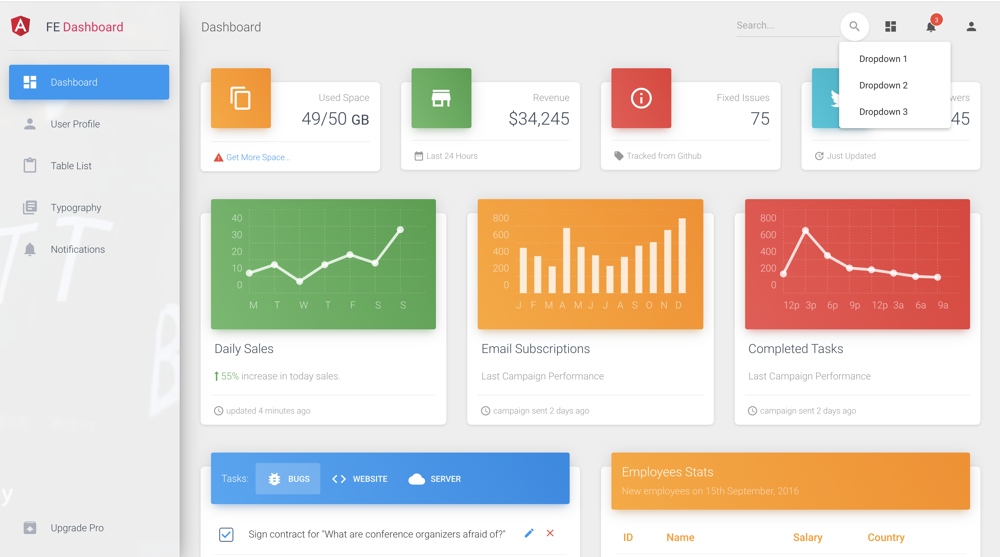
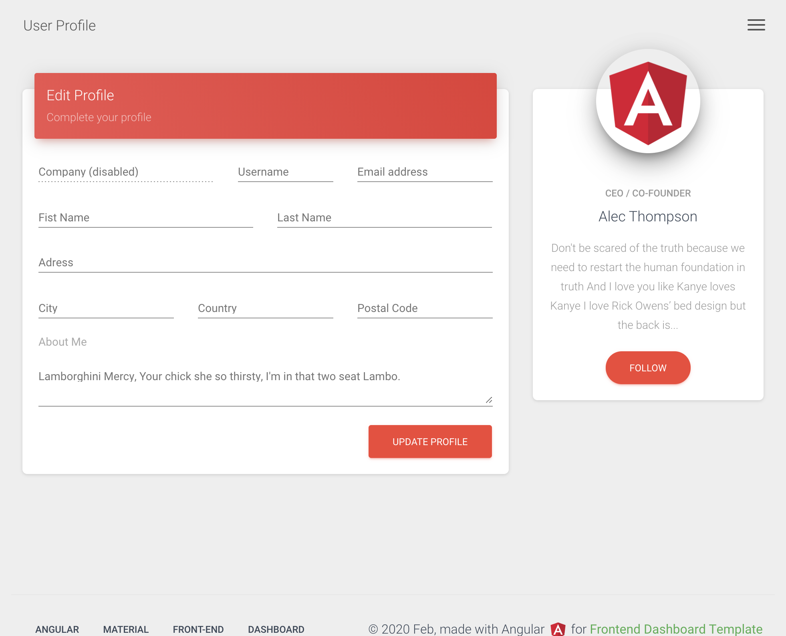
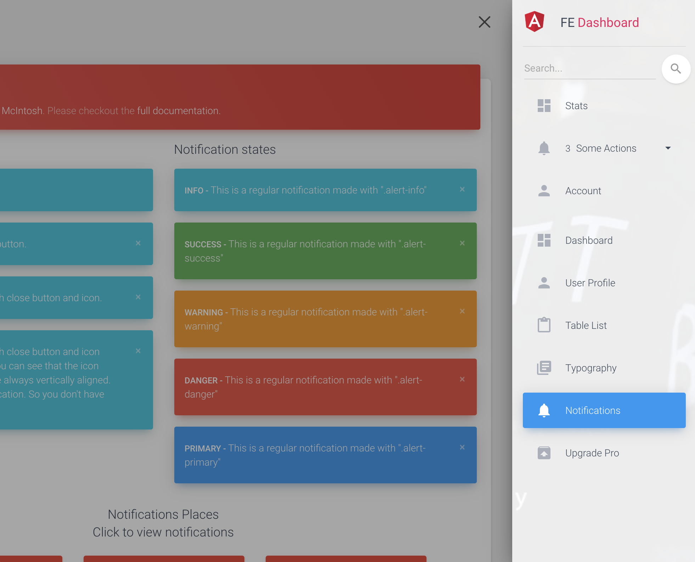

# Angular Material Dashboard

This project was generated with [Angular CLI](https://github.com/angular/angular-cli) version 8.2.1.

## Setup

`npm install`

## Development server

Run `ng serve` for a dev server. Navigate to `http://localhost:4200/`. The app will automatically reload if you change any of the source files.

## Build

Run `ng build` to build the project. The build artifacts will be stored in the `dist/` directory. Use the `--prod` flag for a production build.

## About Project

> This project was implemented for Front-end admin site solutions.

> Using Angular official [Material](https://material.angular.io/) and Creative Tim's [Material Bootstrap](https://demos.creative-tim.com/material-dashboard-angular2) template.

> Modified and used [Own project code architecture](https://github.com/myatthu-mm/FE-BE-Hierarcy).

> Layouts are also responsive.

### What's included

Within the download you'll find the following directories and files:

```
material-dashboard-angular
├── README.md
├── angular-cli.json
├── karma.conf.js
├── package-lock.json
├── package.json
├── protractor.conf.js
├── src
│   ├── app
│   │   ├── app.component.css
│   │   ├── app.component.html
│   │   ├── app.component.ts
│   │   ├── app.module.ts
│   │   ├── app.routing.ts
│   │   ├── components
│   │   │   ├── dashboard
│   │   │   ├── user-profile
│   │   │   ├── table-list
│   │   │   ├── typography
│   │   │   ├── upgrade
│   │   │   └── notifications
│   │   ├── core
│   │   │   ├── auth
│   │   │   ├── http
│   │   │   │   ├── services
│   │   │   │   │   ├── api-http.service
│   │   │   │   │   └── api-endpoints.service
│   │   │   │   ├── classes
│   │   │   │   │   ├── query-string-parameters
│   │   │   │   │   └── url-builder
│   │   │   │   ├── endpoints
│   │   │   │   │   ├── service 0-N
│   │   │   │   │   └── ...........
│   │   │   └── mocks
│   │   ├── entry-components
│   │   │   └──  ............
│   │   ├── layouts
│   │   │   ├── footer
│   │   │   ├── navbar
│   │   │   └── sidebar
│   │   ├── modules
│   │   │   ├── layout.module
│   │   │   ├── material.module
│   │   ├── shared
│   │   │   ├── components
│   │   │   ├── directives
│   │   │   ├── models
│   │   │   ├── services
│   │   │   │   ├── notification.service
│   │   │   └── constants.ts
│   │   ├── views
│   │   │   ├── admin-layout
│   │   │   └── login
│   ├── assets
│   │   ├── images
│   │   └── scss
│   │       ├── core
│   │       └── material-dashboard.scss
│   ├── environments
│   │   ├── environment.prod
│   │   └── environment
│   ├── favicon.ico
│   ├── index.html
│   ├── main.ts
│   ├── polyfills.ts
│   ├── styles.css
│   ├── test.ts
│   ├── tsconfig.app.json
│   ├── tsconfig.spec.json
│   └── typings.d.ts
├── tsconfig.json
├── tslint.json
└── typings

```

## [Live Preview](https://material-dashboard.netlify.com/#/login)

## Screenshots

#### Dashboard Preview



#### Responsive



#### Sidebar Navigation


